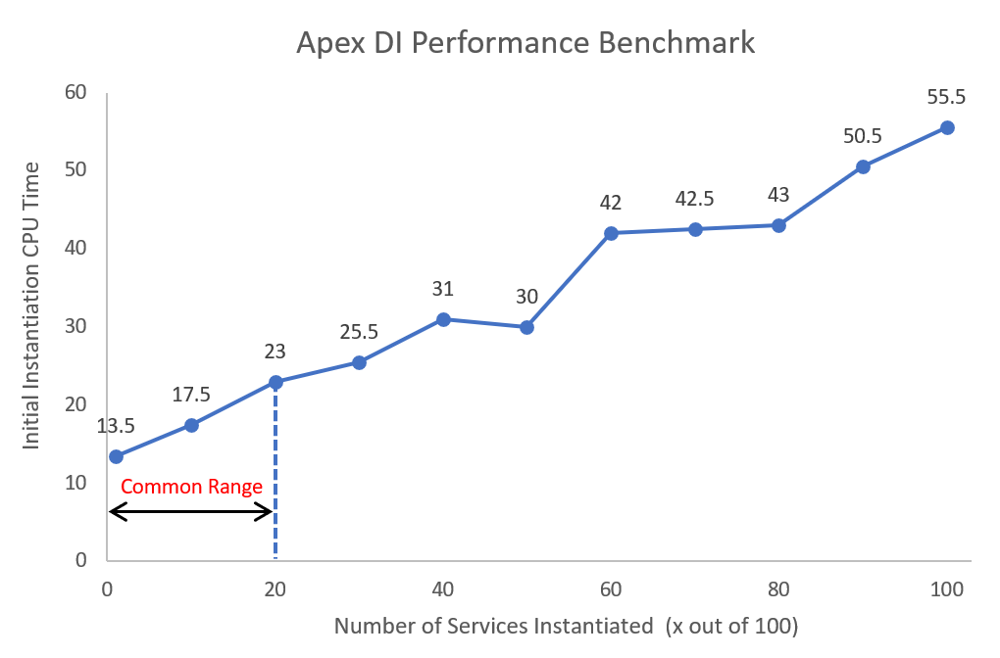

# Apex DI

  

A lightweight Apex dependency injection ([wiki](https://en.wikipedia.org/wiki/Dependency_injection)) framework ported from .Net Core. It can help:

1. Adopt some of the best practices of dependency injection pattern:
   - Decouple implementations and code against abstractions.
   - Highly reusable, extensible and testable code.
2. Manage project development in a modular structure:
   - Create boundaries to avoid loading of unused services into current module.
   - Create dependencies to increase the reusability of services in other modules.

| Environment           | Installation Link                                                                                                                                         | Version   |
| --------------------- | --------------------------------------------------------------------------------------------------------------------------------------------------------- | --------- |
| Production, Developer | <a target="_blank" href="https://login.salesforce.com/packaging/installPackage.apexp?p0=04t2v000007Cg3sAAC"></a> | ver 2.2.4 |
| Sandbox               | <a target="_blank" href="https://test.salesforce.com/packaging/installPackage.apexp?p0=04t2v000007Cg3sAAC"></a>  | ver 2.2.4 |

---

### **v2.x Release Notes**

- **v2.1**: Add scoped lifetime ([jump to section](#21-service-lifetime)).
- **v2.1**: Support generic factory ([jump to section](#33-generic-factory)).
- **v2.2**: Support generic services ([jump to section](#34-generic-service)).
- **v2.2**: Improve performance and provide performance guidelines ([jump to section](#1-performance)).
- **v2.2**: Drop the support of `getServices` API, due to trade-off made after performance tuning.

---

Here is an example controller, when `DI.Module` is used to resolve services. Controller is special in a way that it is running under static context, while our DI is under instance context. In order to fit the gap between them, we used static initializer to "inject" the services into a controller. As you can see, the controller doesn't depend on any concrete types, it becomes thin and clean!

```java
public with sharing class AccountController {
    private static final IAccountService accountService;
    private static final ILogger logger;

    static {
        DI.Module module = DI.getModule(SalesModule.class);
        accountService = (IAccountService) module.getService(IAccountService.class);
        logger = (ILogger) module.getService(ILogger.class);
    }

    @AuraEnabled(cacheable=true)
    public static List<Account> getAccounts(Integer top) {
        try {
            return accountService.getAccounts(top);
        } catch (Exception ex) {
            logger.log(ex);
            throw new AuraHandledException(ex.getMessage());
        }
    }
}
```

### Online Articles

- [Salesforce Dependency Injection with Apex DI](https://medium.com/@jeff.jianfeng.jin/salesforce-project-with-apex-dependency-injection-a3d0e369be25) (medium link)
- [Salesforce Generic Types with Apex DI](https://medium.com/@jeff.jianfeng.jin/salesforce-generic-types-with-apex-di-142a1d8132c3) (medium link)

---

## Table of Contents

- [1. Performance](#1-performance)
  - [1.1 Performance Benchmark](#11-performance-benchmark)
  - [1.2 Performance Consideration](#12-performance-consideration)
- [2. Services](#2-services)
  - [2.1 Service Lifetime](#21-service-lifetime)
  - [2.2 Singleton Lifetime Caveat](#22-singleton-lifetime-caveat)
  - [2.3 Register with Concrete Types](#23-register-with-concrete-types)
  - [2.4 Service Override](#24-service-override)
- [3. Factory](#3-factory)
  - [3.1 Constructor Injection](#31-constructor-injection)
  - [3.2 Factory as Inner Class](#32-factory-as-inner-class)
  - [3.3 Generic Factory](#33-generic-factory)
  - [3.4 Generic Service](#34-generic-service)
- [4. Modules](#4-modules)
  - [4.1 Module Creation](#41-module-creation)
  - [4.2 Module Dependencies](#42-module-dependencies)
  - [4.3 Module File Structure](#43-module-file-structure)
- [5. Tests](#5-tests)
  - [5.1 Test with Mockup Replacement](#51-test-with-mockup-replacement)
  - [5.2 Test with a Mockup Library](#52-test-with-a-mockup-library)
  - [5.3 Test with Ad Hoc Service](#53-test-with-ad-hoc-service)
- [6. API Reference](#6-api-reference)
  - [6.1 DI Class](#61-di-class)
  - [6.2 DI.ServiceCollection Interface](#62-diservicecollection-interface)
  - [6.3 DI.ServiceProvider Interface](#63-diserviceprovider-interface)
  - [6.4 DI.ServiceFactory Interface](#64-diservicefactory-interface)
  - [6.5 DI.Module Abstract Class](#65-dimodule-abstract-class)
  - [6.6 DI.ModuleCollection Interface](#66-dimodulecollection-interface)
- [7. License](#7-license)

## 1. Performance

### 1.1 Performance Benchmark

The performance benchmark are averages of three samples carried under DEBUG debug level in Developer sandbox.

1. Register 100 unique service types with transient lifetime.
2. Resolve the 100 service instances for the first time. The slowness is caused by the type reflection and type loading.
3. Resolve the 100 service instances for second time. Subsequent instantiations are noticeably faster, because the types are cached for reuse.
4. A simple call to `new Something()` for 100 times.

|               | 1. Register 100 Service Types | 2. Resolve 100 Services 1st Time | 3. Resolve 100 Services 2nd Time | 4. New 100 Services |
| ------------- | ----------------------------- | -------------------------------- | -------------------------------- | ------------------- |
| **Time (ms)** | ~7                            | ~70                              | ~19                              | 1                   |
| **CPU Time**  | ~7                            | ~57                              | ~19                              | 0                   |

### 1.2 Performance Consideration

<p align="center"></p>

1. Feel free to use interfaces and abstractions for service registration and resolution, this is a best practice. They have no impact to the performance, and are excluded in the count of above 100 services.
2. Please do not hesitate to use transient lifetime when appropriate. The time spent for its first time realization is the same as singletons. And once a service type is realized, it will be reused for their subsequent realizations, which is faster.
3. Please don't be panic for the 100 services first time resolution performance. In a single transaction, it will definitely not involve 100 unique services to work together. In most cases, the reasonable number of services required per transaction should be within the above **Common Range** (1~20), and the majority should be less than 10.
4. For a project with 1K services registered in a single module, the average warmup time for each transaction should be **~100 ms**. Assume each transaction will realize 20 unique services.
5. However It is strongly recommended to use modules to limit the number of registered services below 100, including services inside dependent modules. So each transaction DI warmup time should be safe in the above **Common Range**.

## 2. Services

Here is a simple example about how to register the service class into a DI container, and resolve it. **[Design Consideration]**: Only type name strings can be used during service registration. This is because in apex, each time a transaction reaches a class declaration on the first time, all its static properties are going to be initialized and loaded at that time. If an Apex DI framework registered with hundreds of classes/interfaces with strong types, the static initialization will harm the performance badly.

```java
public interface IAccountService {}
public with sharing class AccountService implements IAccountService {}

DI.ServiceProvider provider = DI.services()            // 1. create a DI.ServiceCollection
    .addTransient('IAccountService', 'AccountService') // 2. register a service
    .BuildServiceProvider();                           // 3. build a DI.ServiceProvider

IAccountService accountService = (IAccountService) provider.getService(IAccountService.class);
```

### 2.1 Service Lifetime

Every service has a lifetime, the library defined three different widths and lengths of lifetimes. Order from wider longer lifetime to narrower shorter lifetime is Singleton > Scoped > Transient.

1. **Singleton**: the same instance will be returned whenever `getService()` is invoked in organization-wide, even from different `DI.Module` or `DI.ServiceProvider`.
2. **Scoped**: the same instance will be returned only when `getService()` of the same `DI.Module` or `DI.ServiceProvider` is invoked, and different instances will be returned from different modules and providers. Can also be understood as a singleton within a module or provider, but not across them.
3. **Transient**: new instances will be created whenever `getService()` is invoked.

The following code use `DI.ServiceProvider` to create service boundaries. [Modules](#4-modules) following the same lifetime mechanism, since they also implement `DI.ServiceProvider`. The benefit of a `DI.Module` is that, it can import services from their dependent modules.

```java
DI.ServiceProvider providerA = DI.services()
    .addSingleton('IUtility', 'Utility')               // 1. register singleton services
    .addScoped('ILogger', 'TableLogger')               // 2. register scoped services
    .addTransient('IAccountService', 'AccountService') // 3. register transient services
    .BuildServiceProvider();

DI.ServiceProvider providerB = DI.services()
    .addSingleton('IUtility', 'Utility')               // 1. register singleton services
    .addScoped('ILogger', 'TableLogger')               // 2. register scoped services
    .addTransient('IAccountService', 'AccountService') // 3. register transient services
    .BuildServiceProvider();

// 1. Singleton Lifetime:
Assert.areEqual(    // the same service is returned from providerA and providerB
    providerA.getService(IUtility.class),
    providerB.getService(IUtility.class));

// 2. Scoped Lifetime:
Assert.areEqual(    // the same service is returned from providerA
    providerA.getService(ILogger.class),
    providerA.getService(ILogger.class));

Assert.areNotEqual( // different services are returned from providerA and providerB
    providerA.getService(ILogger.class),
    providerB.getService(ILogger.class));

// 3. Transient Lifetime:
Assert.areNotEqual( // different services are returned from providerA
    providerA.getService(IAccountService.class),
    providerA.getService(IAccountService.class));
```

Lifetimes can also be interpreted as the following hierarchy, and together provide flexible configurations of services. As rule of thumb, services registered in higher level (transient) have higher precedence than those registered in lower level (singleton) contexts. More is explained in the next section.

<p align="center"></p>

### 2.2 Singleton Lifetime Caveat

Singleton services are registered in global context at the organization level, once their instances are initialized, they will be cached for future references. So singletons cannot be overrode or replaced at runtime by different providers or modules. This is also the nature of singletons, so the following behavior is expected and will not be considered as an [issue #1](https://github.com/apexfarm/ApexDI/issues/1).

```java
DI.ServiceProvider providerA = DI.services()
    .addSingleton('IUtility', 'Utility')
    .BuildServiceProvider();

// providerA already initialized the IUtility singleton
IUtility util = (IUtility) providerA.getService(IUtility.class);
Assert.isTrue(util instanceof Utility);

// providerB registered another singleton IUtility implementation
DI.ServiceProvider providerB = DI.services()
    .addSingleton('IUtility', 'AnotherUtility')
    .BuildServiceProvider();

// providerB cannot instanciate IUtility singleton with AnotherUtility class
// because providerA already resolved an instance of Utility class.
IUtility anotherUtil = (IUtility) providerB.getService(IUtility.class);
Assert.isFalse(anotherUtil instanceof AnotherUtility);
Assert.areEqual(anotherUtil, util); // the same utitliy instance
```

Once you face this challenge, perhaps your services shouldn't be considered as singletons anymore. Please try to use scoped or transient lifetimes, so the services are registered into a higher level context above the organization level. Again, as rule of thumb, services registered in higher level have higher precedence than those registered in lower level contexts, please reference the hierarchy diagram in above.

```java
// providerC registered another IUtility implementation as scoped lifetime
DI.ServiceProvider providerC = DI.services()
    .addScoped('IUtility', 'AnotherUtility')
    .BuildServiceProvider();

// providerC can instanciate AnotherUtility class which "overrides" the IUtility singleton
IUtility anotherUtil = (IUtility) providerC.getService(IUtility.class);
Assert.isTrue(anotherUtil instanceof AnotherUtility);
Assert.areNotEqual(anotherUtil, util);
```

### 2.3 Register with Concrete Types

It is generally **NOT** recommended, but services can also be registered against their own implementation types. This will no longer enable us to code against abstractions, which is one of the main reason why we choose a DI framework. However, sometimes it is still **OK** for classes to be registered in this way, such as a `Utility` class. (Here `Utility` is not a good class name, by looking at the name we wouldn't know what to do with it, perhaps `Formatter` utility is more obvious.)

```java
DI.ServiceProvider provider = DI.services()
    .addTransient('AccountService')
    .addTransient('AccountService', 'AccountService') // equivalent to above
    .addSingleton('Utility')
    .addSingleton('Utility', 'Utility')               // equivalent to above
    .BuildServiceProvider();

AccountService accountService = (AccountService) provider.getService(AccountService.class);
```

### 2.4 Service Override

When multiple service implementations are registered against the same abstraction/interface, only the last one can be resolved.

```java
public interface ILogger { void error(); void warn(); }
public class EmailLogger implements ILogger {}
public class TableLogger implements ILogger {}
public class AWSS3Logger implements ILogger {}

DI.ServiceProvider provider = DI.services()
    .addSingleton('ILogger', 'EmailLogger')
    .addSingleton('ILogger', 'TableLogger')
    .addSingleton('ILogger', 'AWSS3Logger') // will override ealier registered ILogger
    .BuildServiceProvider();

ILogger logger = (ILogger) provider.getService(ILogger.class)
Assert.isTrue(logger instanceof AWSS3Logger);
```

## 3. Factory

The main reason behind why we use a factory is to achieve constructor injection. Because it is impossible to implement a dynamic injector with current Apex API, so the library uses a factory ([wiki](<https://en.wikipedia.org/wiki/Factory_(object-oriented_programming)>)) + service locator pattern ([wiki](https://en.wikipedia.org/wiki/Service_locator_pattern)) to inject dependencies into a constructor. The **drawback** is that the factory introduces a little additional codes to be maintained manually, but your service class is going to be cleaner. **P.S.** with VS Code language server protocol we can create a VS Code extension to generate the factory classes automatically in future, but it is not our focus for now.

### 3.1 Constructor Injection

Here is an example about how to implement `DI.ServiceFactory` to achieve constructor injection.

```java
// 1. Service Factory
public class AccountServiceFactory implements DI.ServiceFactory {
    public IAccountService newInstance(Type servcieType, DI.ServiceProvider provider) {
        return new AccountService(
            (ILogger) provider.getService(ILogger.class)
        );
    }
}

// 3. Factory Registrition
DI.ServiceProvider provider = DI.services()
    .addTransientFactory('IAccountService', 'AccountServiceFactory')
    .addSingletonFactory('ILogger', 'AWSS3LoggerFactory')
    .BuildServiceProvider();

IAccountService accountService = (IAccountService) provider.getService(IAccountService.class);
```

And here are the definitions of `IAccountService` and `AccountService` to support the above example. `AccountService` doesn't depend on any concrete implementations of other services, which makes it thinner and cleaner!

```java
public interface IAccountService {}

public with sharing class AccountService implements IAccountService {
    private ILogger logger { get; set; }

    public AccountService(ILogger logger) {
        this.logger = logger;
    }
}
```

### 3.2 Factory as Inner Class

We can also define the factory as an inner class of the service, so we don't need to create a separate factory class file, in case the `classes` folder become huge. In this way we can also define the constructor as private, to further prevent the `AccountService` to be new-ed somewhere else.

```java
public with sharing class AccountService implements IAccountService {
    private ILogger logger { get; set; }

    // private constructor
    private AccountService(ILogger logger) {
        this.logger = logger;
    }

    // factory declared as inner class
    public class Factory implements DI.ServiceFactory {
        public IAccountService newInstance(Type servcieType, DI.ServiceProvider provider) {
            return new AccountService(
                (ILogger) provider.getService(ILogger.class)
            );
        }
    }
}

DI.ServiceProvider provider = DI.services()
    // factory registered as inner class
    .addTransientFactory('IAccountService', 'AccountService.Factory')
    .addSingleton('ILogger', 'AWSS3Logger')
    .BuildServiceProvider();
```

### 3.3 Generic Factory

Generic factory enables reusing the same factory to create a family of similar services. When register with factory, just supply a "generic" factory as `FactoryClass<ImplementaionClass>`, then the `ImplementaionClass` will be passed into the `newInstance()` method to help client decide which instance to return at runtime.

```java
public class LoggerFactory implements DI.ServiceFactory {
    public ILogger newInstance(Type servcieType, DI.ServiceProvider provider) {
        if (servcieType == TableLogger.class) {
            return new TableLogger();
        } else if (servcieType == EmailLogger.class) {
            return new EmailLogger();
        } else if (servcieType == AWSS3Logger.class) {
            return new AWSS3Logger();
        }
        return NullLogger();
    }
}

DI.ServiceProvider provider = DI.services()
    .addSingletonFactory('IEmailLogger', 'LoggerFactory<EmailLogger>') // "generic" factory
    .addSingletonFactory('ITableLogger', 'LoggerFactory<TableLogger>') // "generic" factory
    .addSingletonFactory('IAWSS3Logger', 'LoggerFactory<AWSS3Logger>') // "generic" factory
    .BuildServiceProvider();

ILogger emailLogger = (ILogger) provider.getService('IEmailLogger');
ILogger tableLogger = (ILogger) provider.getService('ITableLogger');
ILogger awss3Logger = (ILogger) provider.getService('IAWSS3Logger');
```

### 3.4 Generic Service

Generic service enables reusing the same service template to create a family of services adapt to different scenarios. Similarly just supply generic types when resolve services to allow the `DI.GenericServiceFactory` to create instances according to different generic types.

```java
public class EmailWriter implements IEmailWriter, IWriter { ... }
public class TableWriter implements ITableWriter, IWriter { ... }
public class AWSS3Writer implements IAWSS3Writer, IWriter { ... }

public class Logger implements ILogger {
    private IWriter writer { get; set; }
    public Logger(IWriter writer) { this.writer = writer; }
    public void log(String message) {
        this.writer.write(message);
    }
}

// declare generic service factory
public class LoggerFactory implements DI.GenericServiceFactory {
    public ILogger newInstance(Type servcieType, List<Type> parameterTypes, DI.ServiceProvider provider) {
	return new Logger((IWriter) provider.getService(parameterTypes[0]));
    }
}

DI.ServiceProvider provider = DI.services()
    .addSingleton('IEmailWriter', 'EmailWriter')
    .addSingleton('ITableWriter', 'TableWriter')
    .addSingleton('IAWSS3Writer', 'AWSS3Writer')
    .addSingletonFactory('ILogger', 'LoggerFactory<Logger>')
    .BuildServiceProvider();

ILogger emailLogger = (ILogger) provider.getService('ILogger<IEmailWriter>'); // "generic" service
ILogger tableLogger = (ILogger) provider.getService('ILogger<ITableWriter>'); // "generic" service
ILogger awss3Logger = (ILogger) provider.getService('ILogger<IAWSS3Writer>'); // "generic" service

// equivalent to aboves, multiple .t().t().t() can be chained together
ILogger emailLogger = (ILogger) provider.getService(ILogger.class, DI.types().t(IEmailWriter.class));
ILogger tableLogger = (ILogger) provider.getService(ILogger.class, DI.types().t(ITableWriter.class));
ILogger awss3Logger = (ILogger) provider.getService(ILogger.class, DI.types().t(IAWSS3Writer.class));
```

## 4. Modules

It is highly recommended to use a `DI.Module` to manage service registrations, so it can help:

- Create boundaries to reduce loading of unused services into current module.
- Create dependencies to increase the reusability of services in other modules.

### 4.1 Module Creation

A module can be defined with a class inherited from `DI.Module`. Override method `void configure(DI.ServiceCollection services)` to register services into it. A module can be resolved as a singleton with `DI.getModule(Type moduleType)` API, so the same instance is always returned for the same module class.

```java
public class LogModule extends DI.Module {
    public override void configure(DI.ServiceCollection services) {
        services.addSingleton('ILogger', 'AWSS3Logger');
    }
}

// use module to resolve services
DI.Module logModule = DI.getModule(LogModule.class);
ILogger logger = (ILogger) logModule.getServcie(ILogger.class);
```

### 4.2 Module Dependencies

A module can also have dependencies on the other modules to maximize module reusability. For example, the following `SalesModule` depends on the `LogModule` module defined above. So `ILogger` service can also be injected into services inside `SalesModule`.

```java
public class SalesModule extends DI.Module {
    public override void import(DI.ModuleCollection modules) {  // declare module dependencies
        modules.add('LogModule');
    }

    public override void configure(DI.ServiceCollection services) {
        services
            .addSingleton('IAccountRepository', 'AccountRepository')
            .addTransient('IAccountService', 'AccountService'); // can inject ILogger service
    }
}
```

<p> Module dependencies are resolved as "Last-In, First-Out" order, same as services registered with multiple implementations. For example on the diagram, module 1 depends on module 5 and 2, and module 2 depends on module 4 and 3. The last registered module always take precedence over the prior ones, therefore services will be resolved in order from module 1 to 5.
</p>

```java
public class Module1 extends DI.Module {
    public override void import(DI.ModuleCollection modules) {
        modules.add('Module5');
        modules.add('Module2');
    }
}

public class Module2 extends DI.Module {
    public override void import(DI.ModuleCollection modules) {
        modules.add('Module4');
        modules.add('Module3');
    }

    public override void configure(DI.ServiceCollection services) {
        services.addTransient('ILogger', 'TableLogger');
    }
}

public class Module3 extends DI.Module {
    public override void configure(DI.ServiceCollection services) {
        services.addTransient('ILogger', 'EmailLogger');
    }
}

// module1 realizes TableLogger because module2 is registered after 3
DI.Module module1 = DI.getModule(Module1.class);
ILogger logger1 = (ILogger) module1.getService(ILogger.class);
Assert.isTrue(logger1 instanceof TableLogger);

// module3 still realizes EmailLogger and its boundary is intact
DI.Module module3 = DI.getModule(Module3.class);
ILogger logger3 = (ILogger) module3.getService(ILogger.class);
Assert.isTrue(logger3 instanceof EmailLogger);
```

### 4.3 Module File Structure

When project becomes huge, we can divide modules into different folders, so it gives us focus on the services developing at hands. Please check the sfdx document [Multiple Package Directories](https://developer.salesforce.com/docs/atlas.en-us.sfdx_dev.meta/sfdx_dev/sfdx_dev_ws_mpd.htm) regarding how to do so.

```
|-- sales-module/main/default/
  |-- classes/
    |-- AccountRepository.cls
    |-- AccountService.cls
    |-- IAccountRepository.cls
    |-- IAccountService.cls
    |-- SalesModule.cls
|-- log-module/main/default/
  |-- classes/
    |-- AWSS3Logger.cls
    |-- ILogger.cls
    |-- LogModule.cls
```

## 5. Tests

### 5.1 Test with Mockup Replacement

Take the controller defined at the top of the page as an example, to create the following test class `AccountControllerTest`. Here we try to replace the module returned by `DI.getModule(SalesModule.cass)` inside the controller static initializer with a mock module at runtime.

1. Use `DI.addModule` API to replace `SalesModule` with the `MockSalesModule` defined as inner class. **Note**: `DI.addModule` must be called before the first reference of the `AccountController` class.
1. Extend `SalesModule` with `MockSalesModule`. **Note**: both the `SalesModule` class and its `configure(services)` method need to be declared as `virtual` prior.
1. Use `services.addTransient` to override `IAccountService` with the `MockAccountService` inner class.

```java
@isTest
public class AccountControllerTest {
    @isTest
    static void testGetAccounts() {
        DI.addModule(SalesModule.class, MockSalesModule.class);            // #1
        List<Account> accounts = AccountController.getAccounts(3);
        Assert.areEqual(3, accounts.size());
    }

    public class MockSalesModule extends SalesModule {                     // #2
        protected override void configure(DI.ServiceCollection services) { // #3
            super.configure(services);
            services.addTransient('IAccountService', 'AccountControllerTest.MockAccountService');
        }
    }

    public class MockAccountService implements IAccountService {           // the mockup service
        public List<Account> getAccounts(Integer top) {
            return new List<Account>{ new Account(), new Account(), new Account() };
        }
    }
}
```

### 5.2 Test with a Mockup Library

We can also directly create a mockup service instance and register it against `IAccountService` with `addTransient` API. The following example uses ApexTestKit ([github](https://github.com/apexfarm/ApexTestKit)) as its mocking library.

```java
@isTest
public class AccountControllerTest {
    @isTest
    static void testGetAccounts() {
        DI.addModule(SalesModule.class, MockSalesModule.class);
        List<Account> accounts = AccountController.getAccounts(3);
        Assert.areEqual(3, accounts.size());
    }

    public class MockSalesModule extends DI.Module {
        public override void import(DI.ModuleCollection modules) {
            modules.add('SalesModule');
        }

        public override void configure(DI.ServiceCollection services) {
            // the mockup service
            AccountService mockAccountService = (AccountService) ATK.mock(AccountService.class);
            ATK.startStubbing();
            ATK.given(accountServiceMock.getAccounts(3)).willReturn(
                ATK.prepare(Account.SObjectType, 3)
                	.field(Account.Name).index('Name-{0000}')
                	.mock().get(Account.SObjectType)
            });
            ATK.stopStubbing();

            // register an instance directly
            services.addTransient('IAccountService', mockAccountService);
        }
    }
}
```

### 5.3 Test with Ad Hoc Service

This is not suitable to test static classes as controllers, but will be a convenient way to test particular services on ad hoc basis. The following `AccountService` depends on both `IAccountRepository` and `ILogger` to function. A simple `DI.ServiceProvider` enable us to do the followings:

1. Provide a `NullLogger` to silence the logging service during testing.
2. Replace `IAccountRepository` with a mockup repository to silence the actual requests made to Salesforce database, which gives performance boost quite a lot.

```java
@isTest
public class AccountServiceTest {
    @isTest
    static void testGetAccounts() {
        DI.ServiceProvider provider = DI.services()
            .addTransientFactory('IAccountService', 'AccountService.Factory')
            .addSingleton('IAccountRepository', 'MockupAccountRepository')
            .addSingleton('ILogger', 'AccountServiceTest.NullLogger')
            .BuildServiceProvider();

        IAccountService accountService = (IAccountService.class) provider.getService(IAccountService.class);
        List<Account> accounts = accountService.getAccounts(3);
        Assert.areEqual(3, accounts.size());
    }

    public class NullLogger implements ILogger {
        public void log(Object message) {
            // a null logger silence the logging service during testing
        }
    }
}

public with sharing AccountService {
    private IAccountRepository accountRepository { get; set; }
    private ILogger logger { get; set; }

    public AccountService(IAccountRepository accountRepository, ILogger logger) {
        this.accountRepository = accountRepository;
        this.logger = logger;
    }

    public class Factory implements DI.ServiceFactory {
        public IAccountService newInstance(Type serviceType, DI.ServiceProvider provider) {
            return new AccountService(
                (IAccountRepository) provider.getService(IAccountRepository.class),
                (ILogger) provider.getService(ILogger.class)
            );
        }
    }
}
```

## 6. API Reference

Most of the APIs are ported from .Net Core Dependency Injection framework.

### 6.1 DI Class

| Static Methods                                               | Description                                                                                                                                                                |
| ------------------------------------------------------------ | -------------------------------------------------------------------------------------------------------------------------------------------------------------------------- |
| `DI.ServiceCollection DI.services()`                         | Create an instance of `DI.ServiceCollection`.                                                                                                                              |
| `DI.Module DI.getModule(Type moduleType)`                    | Create a singleton module with services registered. Use the `DI.ServiceProvider` interface to resolve them.                                                                |
| `void DI.addModule(String moduleName, String newModuleName)` | Add a new `newModuleName` to replace the `moduleName` which is referenced somewhere later in the application. Mainly used in test classes, for runtime module replacement. |
| `DI.Types DI.types()`                                        | Return a `DI.Types` instance , to be used in building types for generic services.                                                                                          |

### 6.2 DI.ServiceCollection Interface

Use this interface to register services into the container.

| Methods                                                                                    | Description                                                                                                        |
| ------------------------------------------------------------------------------------------ | ------------------------------------------------------------------------------------------------------------------ |
| `DI.ServiceProvider buildServiceProvider()`                                                | Create `DI.ServiceProvider` with services registered into the container.                                           |
| **Transient**                                                                              |                                                                                                                    |
| `DI.ServiceCollection addTransient(String serviceTypeName)`                                | Register a transient type against its own type.                                                                    |
| `DI.ServiceCollection addTransient(String serviceTypeName, String implementationTypeName)` | Register a transient type against its descendent types.                                                            |
| `DI.ServiceCollection addTransientFactory(String serviceTypeName, String factoryTypeName)` | Register a transient type against its factory type.                                                                |
| `DI.ServiceCollection addTransient(String serviceTypeName, Object instance)`               | Register a transient type against an instance. **Note**: only use this in test class to register a mockup service. |
| **Scoped**                                                                                 |                                                                                                                    |
| `DI.ServiceCollection addScoped(String serviceTypeName)`                                   | Register a scoped type against its own type.                                                                       |
| `DI.ServiceCollection addScoped(String serviceTypeName, String implementationTypeName)`    | Register a scoped type against its descendent types.                                                               |
| `DI.ServiceCollection addScopedFactory(String serviceTypeName, String factoryTypeName)`    | Register a scoped type against its factory type.                                                                   |
| `DI.ServiceCollection addScoped(String serviceTypeName, Object instance)`                  | Register a scoped type against an instance. **Note**: only use this in test class to register a mockup service.    |
| **Singleton**                                                                              |                                                                                                                    |
| `DI.ServiceCollection addSingleton(String serviceTypeName)`                                | Register a singleton type against its own type.                                                                    |
| `DI.ServiceCollection addSingleton(String serviceTypeName, String implementationTypeName)` | Register a singleton type against its descendent types.                                                            |
| `DI.ServiceCollection addSingletonFactory(String serviceTypeName, String factoryTypeName)` | Register a singleton type against its factory type.                                                                |
| `DI.ServiceCollection addSingleton(String serviceTypeName, Object instance)`               | Register a singleton type against an instance, i.e. a constant value.                                              |

### 6.3 DI.ServiceProvider Interface

Use this interface to get the instances of the registered services.

| Methods                                 | Description                                                           |
| --------------------------------------- | --------------------------------------------------------------------- |
| `Object getService(Type serviceType)`   | Get a single service of the supplied type.                            |
| `Object getService(String serviceName)` | Get a single service of the supplied name. Support generic type form. |

### 6.4 Service Factory Interface

Implement these interfaces to define factory classes to create services with constructor injections.

| DI.ServiceFactory Methods                                                  | Description                                                                                                                                             |
| -------------------------------------------------------------------------- | ------------------------------------------------------------------------------------------------------------------------------------------------------- |
| `Object newInstance(Type serviceType, DI.ServiceProvider serviceProvider)` | Use the `serviceProvider` to get the instances of the services defined in the scope. Use `serviceType` in a condition to return polymorphism instances. |

| DI.GenericServiceFactory Methods                                                                      | Description                                                                                                                                    |
| ----------------------------------------------------------------------------------------------------- | ---------------------------------------------------------------------------------------------------------------------------------------------- |
| `Object newInstance(Type serviceType, List<Type> parameterTypes, DI.ServiceProvider serviceProvider)` | Use the `serviceProvider` to get the instances of the services defined in the scope. Parameterized types are supplied as the second parameter. |

### 6.5 DI.Module Abstract Class

Override the following two methods to extend the `DI.Module` class. `DI.Module` class is also an implementation of `DI.ServiceProvider` interface, so all `DI.ServiceProvider` methods can also be invoked.

| Methods                                                            | Description                                                                |
| ------------------------------------------------------------------ | -------------------------------------------------------------------------- |
| `protected override void import(DI.ModuleCollection modules)`      | Override this method to import other module services into this module.     |
| `protected override void configure(DI.ServiceCollection services)` | [**Required**] Override this method to register services into this module. |

### 6.6 DI.ModuleCollection Interface

| Methods                                                         | Description                                                                                                                                                                |
| --------------------------------------------------------------- | -------------------------------------------------------------------------------------------------------------------------------------------------------------------------- |
| `ModuleCollection add(String moduleName)`                       | Add `moduleName` as dependency for the current module.                                                                                                                     |
| `ModuleCollection add(String moduleName, String newModuleName)` | Add a new `moduleName` to replace the `newModuleName` which is referenced somewhere later in the application. Mainly used in test classes, for runtime module replacement. |

## 7. License

Apache 2.0
