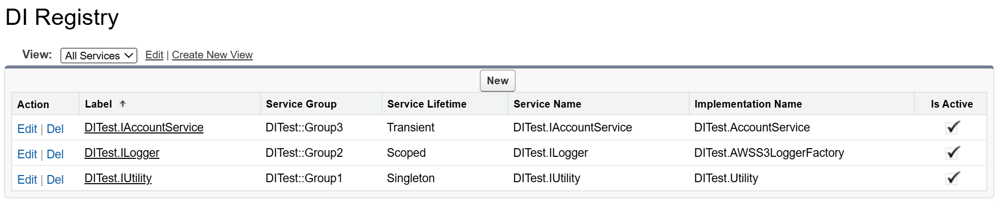

# Apex DI（依赖注入）

  

Apex DI 是一个轻量级的 Apex 依赖注入框架，灵感来自 .NET Core。它可以帮助你：

1. 采用依赖注入最佳实践：
   - 解耦实现，面向抽象编程。
   - 编写高度可复用、可扩展、可测试的代码。
2. 用模块化结构组织项目：
   - 定义边界，防止未使用的服务被加载到模块中。
   - 创建依赖关系，提高服务在模块间的复用性。

| 环境      | 安装链接                                                                                                                                             | 版本   |
| --------- | ---------------------------------------------------------------------------------------------------------------------------------------------------- | ------ |
| 生产/开发 | <a target="_blank" href="https://login.salesforce.com/packaging/installPackage.apexp?p0=04tGC0000071zxZYAQ"></a> | v3.4.1 |
| 沙盒      | <a target="_blank" href="https://test.salesforce.com/packaging/installPackage.apexp?p0=04tGC0000071zxZYAQ"></a>  | v3.4.1 |

---

### 翻译

- [英语](../README.md)

### 发布日志

**v3.4**：

- [伪模块（Pseudo Module）](#42-伪模块)：可通过自定义元数据类型直接加载为单例伪模块。

**v3.3**：

- 升级到 API 版本 64.0。
- [服务注册表](#24-服务注册表)：服务现在可以通过自定义元数据类型进行配置。

**v3.1**：

- [服务工厂接口](#64-服务工厂)参数顺序变更：
  - `newInstance(DI.ServiceProvider provider, Type serviceType)`
  - `newInstance(DI.ServiceProvider provider, Type serviceType, List<String> parameterNames)`

---

这是一个使用 `DI.Module` 解析服务的 Controller 示例。可以看到，Controller 不依赖于任何具体类型，使其简洁且易于维护！

```java
public with sharing class AccountController {
    private static final IAccountService accountService;
    private static final ILogger logger;

    static {
        DI.Module module = DI.modules().get(SalesModule.class);
        accountService = (IAccountService) module.getService(IAccountService.class);
        logger = (ILogger) module.getService(ILogger.class);
    }

    @AuraEnabled(cacheable=true)
    public static List<Account> getAccounts(Integer top) {
        try {
            return accountService.getAccounts(top);
        } catch (Exception ex) {
            logger.log(ex);
            throw new AuraHandledException(ex.getMessage());
        }
    }
}
```

### 在线文章

- [Salesforce 依赖注入与 Apex DI](https://medium.com/@jeff.jianfeng.jin/salesforce-project-with-apex-dependency-injection-a3d0e369be25)
- [Salesforce 泛型与 Apex DI](https://medium.com/@jeff.jianfeng.jin/salesforce-generic-types-with-apex-di-142a1d8132c3)

---

## 目录

- [1. 性能](#1-性能)
- [2. 服务](#2-服务)
  - [2.1 服务生命周期](#21-服务生命周期)
  - [2.2 注册具体类型](#22-注册具体类型)
  - [2.3 服务覆盖](#23-服务覆盖)
  - [2.4 服务注册表](#24-服务注册表)
- [3. 工厂](#3-工厂)
  - [3.1 工厂类](#31-工厂类)
  - [3.2 内部工厂类](#32-内部工厂类)
  - [3.3 泛型工厂](#33-泛型工厂)
- [4. 模块](#4-模块)
  - [4.1 模块创建](#41-模块创建)
  - [4.2 伪模块](#42-伪模块)
  - [4.3 模块依赖](#43-模块依赖)
  - [4.4 模块文件结构](#44-模块文件结构)
- [5. 测试](#5-测试)
  - [5.1 服务 Mock 测试](#51-服务-mock-测试)
  - [5.2 模块 Mock 测试](#52-模块-mock-测试)
- [6. API 参考](#6-api-参考)
  - [6.1 DI 类](#61-di-类)
  - [6.2 DI.ServiceCollection](#62-diservicecollection)
  - [6.3 DI.ServiceProvider](#63-diserviceprovider)
  - [6.4 服务工厂](#64-服务工厂)
  - [6.5 DI.Module](#65-dimodule)
  - [6.6 DI.GlobalModuleCollection](#66-diglobalmodulecollection)
- [7. 许可证](#7-许可证)

## 1. 性能

<p align="center"></p>

1. 使用类名注册服务目前是最快的方案，几乎没有性能损耗（**绿色线**）。
2. 推荐使用接口和抽象进行服务注册和解析，最佳实践且无性能影响。
3. 合理使用瞬态（transient）生命周期。服务一旦被实例化，其“构造器”可被复用，几乎无额外开销（**蓝色线**）。
4. 强烈建议用模块划分服务，每个模块服务数量建议控制在 100 以内。

## 2. 服务

以下是将服务类注册到 DI 容器的简单示例。

```java
public interface IAccountService {}
public with sharing class AccountService implements IAccountService {}

DI.ServiceProvider provider = DI.services()            // 1. 创建 DI.ServiceCollection
    .addTransient('IAccountService', 'AccountService') // 2. 注册服务
    .BuildServiceProvider();                           // 3. 构建 DI.ServiceProvider

IAccountService accountService = (IAccountService) provider.getService(IAccountService.class);
```

### 2.1 服务生命周期

本库定义了三种不同宽度和长度的生命周期：

1. **单例（Singleton）**：无论从哪个 `DI.Module` 或 `DI.ServiceProvider` 获取，始终返回同一实例。
2. **作用域（Scoped）**：仅在同一 `DI.Module` 或 `DI.ServiceProvider` 内返回同一实例。
3. **瞬态（Transient）**：每次获取服务都会创建新实例。

生命周期也可理解为如下层级，注册在高层级（瞬态）的服务优先级高于低层级（单例）上下文。

<p align="center"></p>

以下代码用 `DI.ServiceProvider` 创建服务边界。[模块](#4-模块) 也遵循同样机制。

```java
DI.ServiceProvider providerA = DI.services()
    .addSingleton('IUtility', 'Utility')               // 1. 注册单例服务
    .addScoped('ILogger', 'TableLogger')               // 2. 注册作用域服务
    .addTransient('IAccountService', 'AccountService') // 3. 注册瞬态服务
    .BuildServiceProvider();

DI.ServiceProvider providerB = DI.services()
    .addSingleton('IUtility', 'Utility')               // 1. 注册单例服务
    .addScoped('ILogger', 'TableLogger')               // 2. 注册作用域服务
    .addTransient('IAccountService', 'AccountService') // 3. 注册瞬态服务
    .BuildServiceProvider();

// 1. 单例生命周期：
Assert.areEqual(    // providerA 和 providerB 返回同一服务
    providerA.getService(IUtility.class),
    providerB.getService(IUtility.class));

// 2. 作用域生命周期：
Assert.areEqual(    // providerA 内返回同一服务
    providerA.getService(ILogger.class),
    providerA.getService(ILogger.class));

Assert.areNotEqual( // providerA 和 providerB 返回不同服务
    providerA.getService(ILogger.class),
    providerB.getService(ILogger.class));

// 3. 瞬态生命周期：
Assert.areNotEqual( // providerA 内返回不同服务
    providerA.getService(IAccountService.class),
    providerA.getService(IAccountService.class));
```

### 2.2 注册具体类型

有时可以用具体类型注册服务类，如 Utility 类。

```java
DI.ServiceProvider provider = DI.services()
    .addSingleton('Utility')
    .addSingleton('Utility', 'Utility')               // 等价于上面
    .addSingleton('Constants')
    .addSingleton('Constants', 'Constants')           // 等价于上面
    .BuildServiceProvider();

Utility utility = (Utility) provider.getService(Utility.class);
```

### 2.3 服务覆盖

同一接口注册多个同名服务时，只有最后一个会被解析。

```java
public interface ILogger { void error(); void warn(); }
public class EmailLogger implements ILogger {}
public class TableLogger implements ILogger {}
public class AWSS3Logger implements ILogger {}

DI.ServiceProvider provider = DI.services()
    .addSingleton('ILogger', 'EmailLogger')
    .addSingleton('ILogger', 'TableLogger')
    .addSingleton('ILogger', 'AWSS3Logger') // 覆盖前面注册的 ILogger
    .BuildServiceProvider();

ILogger logger = (ILogger) provider.getService(ILogger.class)
Assert.isTrue(logger instanceof AWSS3Logger);
```

### 2.4 服务注册表

<p align="center"></p>

服务也可通过 `DIRegistry__mdt` 注册。要加载 `DITest::*` 组下所有服务，使用 `addFromRegistry` API。此方法也适用于 `DI.Module` 配置。**注意**：工厂实现类名需以 `Factory` 结尾。

```java
DI.ServiceProvider provider = DI.services()
    .addFromRegistry('DITest') // 服务组前缀
    .buildServiceProvider();
```

服务组名作为逻辑命名空间，如 `group::subgroup`。如无需加载整个组，可指定子组。注册表注册可与代码注册结合，注册表服务总是先于代码注册服务加载。

```java
DI.ServiceProvider provider = DI.services()
    .addFromRegistry('DITest::Group1')                 // 服务组前缀
    .addScoped('DITest.ILogger', 'DITest.TableLogger') // 代码注册
    .buildServiceProvider();
```

可同时加载多个组，加载顺序很重要——后加载的组会覆盖前面组中同名服务。

```java
DI.ServiceProvider provider = DI.services()
    .addFromRegistry('GroupA')
    .addFromRegistry('GroupB')
    .addFromRegistry('GroupC')
    .buildServiceProvider();
```

## 3. 工厂

### 3.1 工厂类

以下为实现 `DI.ServiceFactory` 以实现构造函数注入的示例。

```java
// 1. 服务工厂
public class AccountServiceFactory implements DI.ServiceFactory {
    public IAccountService newInstance(DI.ServiceProvider provider, Type serviceType) {
        return new AccountService((ILogger) provider.getService(ILogger.class));
    }
}

// 2. 工厂注册
DI.ServiceProvider provider = DI.services()
    .addTransientFactory('IAccountService', 'AccountServiceFactory')
    .addSingleton('ILogger', 'TableLogger')
    .BuildServiceProvider();

// 3. 服务解析
IAccountService accountService = (IAccountService) provider.getService(IAccountService.class);
```

### 3.2 内部工厂类

工厂也可定义为服务的内部类，构造函数可设为 private 增强封装性。

```java
public with sharing class AccountService implements IAccountService {
    private ILogger logger { get; set; }

    // 私有构造函数
    private AccountService(ILogger logger) {
        this.logger = logger;
    }

    // 工厂声明为内部类
    public class Factory implements DI.ServiceFactory {
        public IAccountService newInstance(DI.ServiceProvider provider, Type serviceType) {
            return new AccountService((ILogger) provider.getService(ILogger.class));
        }
    }
}

DI.ServiceProvider provider = DI.services()
    .addTransientFactory('IAccountService', 'AccountService.Factory')
    .addSingleton('ILogger', 'AWSS3Logger')
    .BuildServiceProvider();
```

### 3.3 泛型工厂

泛型服务可复用同一工厂和模板类，创建一组服务。

```java
public class EmailWriter implements IEmailWriter, IWriter { ... }
public class TableWriter implements ITableWriter, IWriter { ... }
public class AWSS3Writer implements IAWSS3Writer, IWriter { ... }

public class Logger implements ILogger {
    private IWriter writer { get; set; }                     // 依赖
    public Logger(IWriter writer) { this.writer = writer; }  // 构造函数
    public void log(String message) {                        // 方法
        this.writer.write(message);
    }
}

// 声明泛型服务工厂
public class LoggerFactory implements DI.GenericServiceFactory {
    public ILogger newInstance(DI.ServiceProvider provider, Type serviceType,
        List<String> parameterNames) {
        String writerName = parameterNames[0];
        return new Logger((IWriter) provider.getService(writerName));
    }
}

DI.ServiceProvider provider = DI.services()
    .addSingleton('IEmailWriter', 'EmailWriter')
    .addSingleton('ITableWriter', 'TableWriter')
    .addSingleton('IAWSS3Writer', 'AWSS3Writer')
    .addSingletonFactory('ILogger', 'LoggerFactory<Logger>')
    .BuildServiceProvider();

ILogger emailLogger = (ILogger) provider.getService('ILogger<IEmailWriter>');
ILogger tableLogger = (ILogger) provider.getService('ILogger<ITableWriter>');
ILogger awss3Logger = (ILogger) provider.getService('ILogger<IAWSS3Writer>');
```

## 4. 模块

强烈建议用 `DI.Module` 管理服务注册。这样可以：

- 创建边界，限制当前模块注册的服务数量。
- 定义依赖，提高服务在模块间的复用性。

### 4.1 模块创建

模块为单例，调用 `DI.modules().get()` 同类型始终返回同一实例。

```java
public class LogModule extends DI.Module {
    public override void configure(DI.ServiceCollection services) {
        services.addSingleton('ILogger', 'AWSS3Logger');
    }
}

// 用模块解析服务
DI.Module logModule = DI.modules().get(LogModule.class);
ILogger logger = (ILogger) logModule.getService(ILogger.class);
```

### 4.2 伪模块

可通过传入 `Pseudo<服务组前缀>` 字符串，直接将注册表服务组加载为单例 `DI.Module`。也可将多个服务组合并为一个伪模块。

<p align="center"></p>

```java
DI.Module moduleA = DI.modules().get('Pseudo<DITest>');
DI.Module moduleB = DI.modules().get('Pseudo<DITest>');
Assert.areEqual(moduleA, moduleB); // 返回同一模块实例

DI.Module moduleC = DI.modules().get('Pseudo<DITest::Group1, DITest::Group2, DITest::Group3>');
Assert.areNotEqual(moduleC, moduleB);
```

### 4.3 模块依赖

模块可依赖其他模块。例如，`SalesModule` 依赖 `LogModule`，因此 `ILogger` 服务也可在 `SalesModule` 内解析。

```java
public class SalesModule extends DI.Module {
    // 声明模块依赖
    public override void import(DI.ModuleCollection modules) {
        modules.add('LogModule');
    }

    public override void configure(DI.ServiceCollection services) {
        services
            .addSingleton('IAccountRepository', 'AccountRepository')
            .addTransient('IAccountService', 'AccountService');
    }
}
```

<p> 模块依赖按“后进先出”顺序解析。例如，图中服务解析顺序为模块 1 到 5。
</p>

```java
public class Module1 extends DI.Module {
    public override void import(DI.ModuleCollection modules) {
        modules.add('Module5');
        modules.add('Module2');
    }
}

public class Module2 extends DI.Module {
    public override void import(DI.ModuleCollection modules) {
        modules.add('Module4');
        modules.add('Module3');
    }

    public override void configure(DI.ServiceCollection services) {
        services.addTransient('ILogger', 'TableLogger');
    }
}

public class Module3 extends DI.Module {
    public override void configure(DI.ServiceCollection services) {
        services.addTransient('ILogger', 'EmailLogger');
    }
}

// module1 解析 TableLogger，因为 module2 在 module3 之后注册
DI.Module module1 = DI.modules().get(Module1.class);
ILogger logger1 = (ILogger) module1.getService(ILogger.class);
Assert.isTrue(logger1 instanceof TableLogger);

// module3 仍解析 EmailLogger，边界独立
DI.Module module3 = DI.modules().get(Module3.class);
ILogger logger3 = (ILogger) module3.getService(ILogger.class);
Assert.isTrue(logger3 instanceof EmailLogger);
```

### 4.4 模块文件结构

项目庞大时，建议将模块分文件夹管理。

```
|-- sales-module/main/default/
  |-- classes/
    |-- AccountRepository.cls
    |-- AccountService.cls
    |-- IAccountRepository.cls
    |-- IAccountService.cls
    |-- SalesModule.cls
|-- log-module/main/default/
  |-- classes/
    |-- AWSS3Logger.cls
    |-- ILogger.cls
    |-- LogModule.cls
```

## 5. 测试

### 5.1 服务 Mock 测试

如下 `AccountService` 依赖 `ILogger`。用 `DI.ServiceProvider` 可注入 `NullLogger` 静默日志。

```java
@isTest
public class AccountServiceTest {
    @isTest
    static void testGetAccounts() {
        DI.ServiceProvider provider = DI.services()
            .addTransientFactory('IAccountService', 'AccountService.Factory')
            .addSingleton('ILogger', 'AccountServiceTest.NullLogger')
            .BuildServiceProvider();

        IAccountService accountService = (IAccountService.class) provider.getService(IAccountService.class);
        List<Account> accounts = accountService.getAccounts(3);
        Assert.areEqual(3, accounts.size());
    }

    public class NullLogger implements ILogger {
        public void log(Object message) {
            // 测试时静默日志
        }
    }
}
```

### 5.2 模块 Mock 测试

下面为顶层 `AccountController` 提供 mock `SalesModule` 的方法。

1. 用 `DI.modules().replace()` 替换 `SalesModule` 为 `MockSalesModule`。**注意**：`replace()` 必须在首次引用 `AccountController` 前调用。
2. 继承 `SalesModule`，实现 `MockSalesModule`。**注意**：`SalesModule` 类及其 `configure(services)` 方法需声明为 `virtual`。
3. 用 `services.addTransient` 覆盖 `IAccountService`。

```java
@isTest
public class AccountControllerTest {
    @isTest
    static void testGetAccounts() {
        DI.modules().replace(SalesModule.class, MockSalesModule.class);    // #1
        List<Account> accounts = AccountController.getAccounts(3);
        Assert.areEqual(3, accounts.size());
    }

    public class MockSalesModule extends SalesModule {                     // #2
        protected override void configure(DI.ServiceCollection services) { // #3
            super.configure(services);
            services.addTransient('IAccountService', 'AccountControllerTest.MockAccountService');
        }
    }

    public class MockAccountService implements IAccountService {           // mock 服务
        public List<Account> getAccounts(Integer top) {
            return new List<Account>{ new Account(), new Account(), new Account() };
        }
    }
}
```

## 6. API 参考

大部分 API 源自 .Net Core 依赖注入框架。

### 6.1 DI 类

| 静态方法                                 | 说明                                    |
| ---------------------------------------- | --------------------------------------- |
| `DI.ServiceCollection DI.services()`     | 创建 `DI.ServiceCollection` 实例。      |
| `DI.GlobalModuleCollection DI.modules()` | 返回 `DI.GlobalModuleCollection` 单例。 |

### 6.2 DI.ServiceCollection

| 方法                                                                                       | 说明                                                 |
| ------------------------------------------------------------------------------------------ | ---------------------------------------------------- |
| `DI.ServiceProvider buildServiceProvider()`                                                | 用已注册服务创建 `DI.ServiceProvider`。              |
| `DI.ServiceProvider addFromRegistry(String serviceGroupPrefix)`                            | 用组名前缀从 `DIRegistry__mdt` 注册所有服务。        |
| **瞬态**                                                                                   |                                                      |
| `DI.ServiceCollection addTransient(String serviceTypeName)`                                | 注册自身类型为瞬态。                                 |
| `DI.ServiceCollection addTransient(String serviceTypeName, String implementationTypeName)` | 注册子类型为瞬态。                                   |
| `DI.ServiceCollection addTransientFactory(String serviceTypeName, String factoryTypeName)` | 注册工厂类型为瞬态。                                 |
| `DI.ServiceCollection addTransient(String serviceTypeName, Object instance)`               | 注册实例为瞬态。**仅测试类注册 mock 服务时使用。**   |
| **作用域**                                                                                 |                                                      |
| `DI.ServiceCollection addScoped(String serviceTypeName)`                                   | 注册自身类型为作用域。                               |
| `DI.ServiceCollection addScoped(String serviceTypeName, String implementationTypeName)`    | 注册子类型为作用域。                                 |
| `DI.ServiceCollection addScopedFactory(String serviceTypeName, String factoryTypeName)`    | 注册工厂类型为作用域。                               |
| `DI.ServiceCollection addScoped(String serviceTypeName, Object instance)`                  | 注册实例为作用域。**仅测试类注册 mock 服务时使用。** |
| **单例**                                                                                   |                                                      |
| `DI.ServiceCollection addSingleton(String serviceTypeName)`                                | 注册自身类型为单例。                                 |
| `DI.ServiceCollection addSingleton(String serviceTypeName, String implementationTypeName)` | 注册子类型为单例。                                   |
| `DI.ServiceCollection addSingletonFactory(String serviceTypeName, String factoryTypeName)` | 注册工厂类型为单例。                                 |
| `DI.ServiceCollection addSingleton(String serviceTypeName, Object instance)`               | 注册实例为单例，即常量值。                           |

### 6.3 DI.ServiceProvider

| 方法                                    | 说明                 |
| --------------------------------------- | -------------------- |
| `Object getService(Type serviceType)`   | 获取指定类型的服务。 |
| `Object getService(String serviceName)` | 获取指定名称的服务。 |

### 6.4 服务工厂

| DI.ServiceFactory 接口                                              | 说明                                                                           |
| ------------------------------------------------------------------- | ------------------------------------------------------------------------------ |
| `Object newInstance(DI.ServiceProvider provider, Type serviceType)` | 用 `serviceProvider` 获取当前作用域服务。可用 `serviceType` 条件返回多态实例。 |

| DI.GenericServiceFactory 接口                                                                    | 说明                        |
| ------------------------------------------------------------------------------------------------ | --------------------------- |
| `Object newInstance(DI.ServiceProvider provider, Type serviceType, List<String> parameterNames)` | 额外提供 `parameterTypes`。 |

### 6.5 DI.Module

| 方法                                                               | 说明                            |
| ------------------------------------------------------------------ | ------------------------------- |
| `protected override void import(DI.ModuleCollection modules)`      | 重写此方法导入其他模块服务。    |
| `protected override void configure(DI.ServiceCollection services)` | [**必需**] 重写此方法注册服务。 |

### 6.6 DI.GlobalModuleCollection

| 静态方法                                                | 说明                 |
| ------------------------------------------------------- | -------------------- |
| `DI.Module get(string moduleName)`                      | 创建并返回单例模块。 |
| `DI.Module get(Type moduleType)`                        | 创建并返回单例模块。 |
| `void replace(String moduleName, String newModuleName)` | 单元测试中替换模块。 |
| `void replace(Type moduleType, Type newModuleType)`     | 单元测试中替换模块。 |

## 7. 许可证

Apache 2.0
